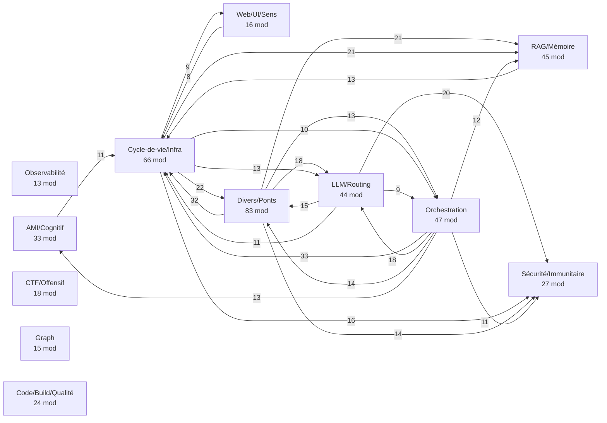
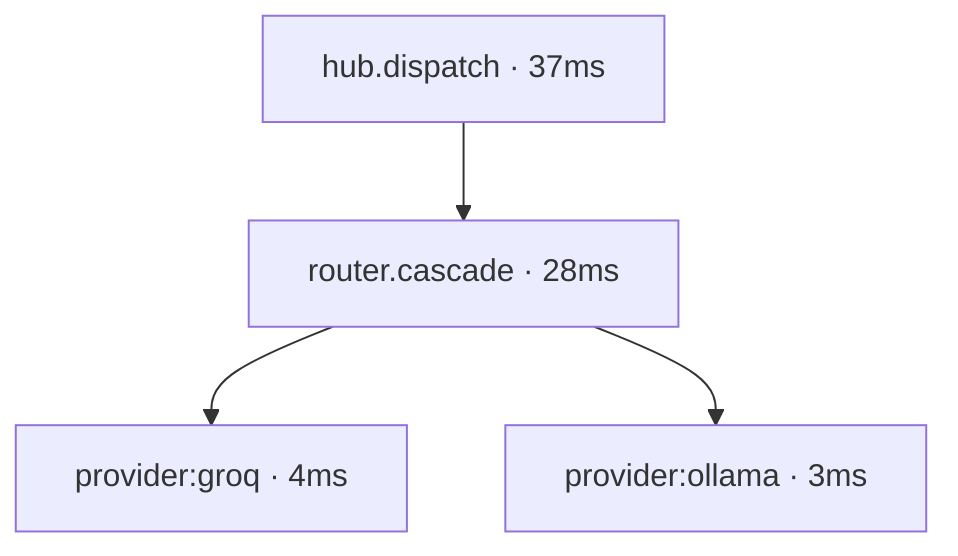

# Nokido — Schéma d'architecture multi-couches (auto-généré, souverain)

Complément data-driven de [ARCHITECTURE.md](ARCHITECTURE.md) (narrative). Tout est
extrait du code/runtime — zéro doc manuelle obsolète, zéro backend pour le statique.

Régénérer : `trusted_script forge_arch_schema.py` (le sandbox run-python est aveugle
à `app/` sous WORKSPACE_GUARD → contexte host requis). Dynamique :
`forge_trace_viz <trace_id> --tree`. Dashboard : Phoenix `:6006`.

---

## Couche 1 — Structure statique (import-graph AST, **complet**)

**431 modules** `app/forge_*.py` · **730 liens** internes · 93 racines · 124 feuilles · 51 orphelins.
Les 431 modules sont **tous** rattachés à un domaine (inventaire intégral plus bas).

### Carte par domaine (backbone, arêtes ≥ 8 liens)

Lecture : **Cycle-de-vie/Infra** (66) + **Orchestration** (47) = le tronc ; tout
converge vers Infra (`mcp_registry`, `app_context`, `secrets`). **LLM/Routing** (44)
alimente **Sécurité** (firewall sur chaque appel cloud). **Divers/Ponts** (83) = les
connecteurs transverses (bridges, npu, hw, watchers). *(arêtes < 8 omises ; graphe
complet via le générateur.)*

### Top 18 hubs (centralité = liens entrants + sortants)

| module | out | in | domaine |
|---|--:|--:|---|
| `mcp_registry` | 57 | 1 | Cycle-de-vie/Infra |
| `Nokido` | 41 | 0 | Divers/Ponts |
| `app_context` | 2 | 34 | Cycle-de-vie/Infra |
| `secrets` | 1 | 26 | Sécurité/Immunitaire |
| `llm_router` | 15 | 8 | LLM/Routing |
| `rag_engine` | 10 | 11 | RAG/Mémoire |
| `self_correction` | 3 | 18 | Orchestration |
| `agent_proxy` | 13 | 6 | LLM/Routing |
| `context` | 1 | 18 | Cycle-de-vie/Infra |
| `handlers` | 12 | 4 | Orchestration |
| `ollama` | 5 | 11 | LLM/Routing |
| `mcp_server_tools` | 16 | 0 | Cycle-de-vie/Infra |
| `swarm_team` | 6 | 8 | Orchestration |
| `at_dispatch` | 8 | 4 | Orchestration |
| `mpc` | 10 | 2 | Orchestration |
| `agents` | 6 | 5 | Divers/Ponts |
| `litellm_bridge` | 6 | 5 | LLM/Routing |
| `llamacpp` | 1 | 10 | LLM/Routing |

### Inventaire intégral par domaine (431 modules)

<b>Observabilité</b> (13)

`audit`, `audit_log`, `audit_personas`, `audit_reducer`, `audit_worker`, `execution_tracer`, `langfuse_hook`, `metrics`, `network_logger`, `panorama_builder`, `scorecard`, `span`, `trace_context`

<b>Sécurité/Immunitaire</b> (27)

`agent_authority`, `auth_jwt`, `coagulation_cascade`, `commit_guard`, `encrypt`, `guarded_change`, `immune_adaptive`, `integrity`, `jwt_router`, `machine_vault`, `mcp_rbac`, `noise_guardian`, `noise_inject`, `opsec`, `prompt_guard`, `rbac`, `rbac_mapping`, `sandbox_guard`, `secret_guard`, `secrets`, `semantic_firewall`, `sentinel`, `snapshot`, `sovereign_membrane`, `trauma_vault`, `triad_authority`, `workspace_guard`

<b>AMI/Cognitif</b> (33)

`active_inference`, `active_inference_agent`, `actor`, `anatomy_state`, `circadian`, `circadian_loop`, `continual_backprop`, `cost_module`, `cost_net`, `curiosity_driver`, `endocrine`, `flow_zone`, `glymphatic_gc`, `goap_intuition`, `homeostasis_orchestrator`, `hormones`, `hormones_subscriber`, `js_endpoint_extractor`, `lnn_monitor`, `metacognition_gate`, `motivation`, `novelty_organ`, `novelty_search`, `policy_net`, `proprioception`, `renal_clearance`, `semantic_pressure`, `snn_monitor`, `spike_router`, `system_mood`, `tem_factorize`, `value_net`, `world_model`

<b>CTF/Offensif</b> (18)

`biblio_sanitizer`, `cai_bridge`, `conv_sanitizer`, `ctf_agent`, `ctf_browser_mcp`, `ctf_browser_supervisor`, `ctf_solver`, `dispatch_network`, `exegol_mcp_server`, `exegol_supervisor`, `gdb_live`, `handler_network`, `heap_engine`, `mcp_exploit_runner`, `network`, `network_dispatch`, `reconstruction_loss`, `sanitizer_analyst`

<b>Graph</b> (15)

`graph_cve_propagation`, `graph_edge_scorer`, `graph_explorer`, `graph_linker`, `graph_lru`, `graph_ppr`, `graph_rag`, `graph_rag_hops`, `graph_search`, `graph_studio`, `graph_universal`, `hebbian_linker`, `nlgraph_runner`, `nlgraph_scorer`, `project_state_graph`

<b>RAG/Mémoire</b> (45)

`auto_ingest_daemon`, `biblio_core`, `biblio_refine`, `biblio_schema`, `biblio_worker`, `conv_indexer`, `dist_storage`, `distiller`, `embed_router`, `epistemic_retrieve`, `handler_fragment`, `handler_rag`, `hippocampus`, `hot_ingest`, `hub_storage`, `hybrid_bridge`, `hybrid_retriever`, `ingest_pipeline`, `ingest_self`, `ingestion_pipeline`, `knowledge_distiller`, `knowledge_harvester`, `memory`, `memory_archival`, `mesh_memory`, `mixin_rag`, `npu_embedder`, `ollama_memory`, `rag_cache`, `rag_engine`, `rag_index_app`, `rag_janitor`, `rag_mixin`, `rag_qualify`, `rag_store`, `rag_truth`, `rag_warmup`, `sigreg`, `silo_fragmenter`, `skill_rag_bridge`, `stm`, `synaptic_plasticity`, `tldr_context`, `trust_score`, `vector_index`

<b>LLM/Routing</b> (44)

`agent_proxy`, `agent_roles`, `byte_router`, `cascade_oracle`, `cognitive_router`, `core_models`, `dspy_router`, `dt_router`, `failsafe_router`, `frugal_cascade`, `gemini_bridge`, `ghost_router`, `handoff`, `handoff_compress`, `intent_parser`, `litellm_bridge`, `litellm_connector`, `llamacpp`, `llamacpp_scorer`, `llm`, `llm_budget`, `llm_router`, `llm_router_dt`, `llm_transport`, `lmstudio`, `md_router`, `nlu`, `ollama`, `ollama_bridge`, `openrouter`, `provider_admin`, `provider_quota`, `provider_specs`, `provider_watcher`, `quota_manager`, `quota_tracker`, `roles`, `roles_legacy`, `router_gateway`, `swarm_agents`, `task_router`, `token_monitor`, `token_watchdog`, `tokenizer`

<b>Orchestration</b> (47)

`agent_lats`, `at_dispatch`, `autonomous_loops`, `autonomous_orchestrator`, `commands`, `dag_runner`, `dispatch`, `dispatch_ai`, `dispatchers`, `goap`, `handler_advanced`, `handler_agents`, `handler_build`, `handler_ci`, `handler_evolve`, `handler_nr`, `handler_patch`, `handler_skill`, `handlers`, `hub_handlers`, `lats`, `lats_general`, `loop`, `meta_evolution`, `meta_tools`, `mpc`, `mpc_executor`, `orchestration_benchmark`, `orchestrator`, `orchestrator_scaller`, `pipeline_node`, `plan_validator`, `self_correction`, `self_refinement`, `silo_engine`, `swarm`, `swarm_bus`, `swarm_context`, `swarm_orchestrator`, `swarm_patch`, `swarm_team`, `swarm_validator`, `swarm_worker`, `task_bus`, `task_queue`, `test_fix_loop`, `trajectory`

<b>Cycle-de-vie/Infra</b> (66)

`app_context`, `boot`, `bootstrap`, `bounded_queue`, `clawhub_autoinstall`, `clawhub_bridge`, `context`, `context_steadiness`, `conversation_logger`, `critical_events`, `db`, `db_conn`, `db_path`, `docker_sandbox`, `docker_supervisor`, `event_stream`, `events`, `github_mcp_connector`, `health`, `health_diagnostic`, `heartbeat`, `hub_client`, `hub_worker`, `idle_watchdog`, `inspector`, `job_runner`, `jobid`, `lifecycle_tool`, `lock_manager`, `log_rotation`, `logging`, `mailbox`, `mcp_registry`, `mcp_safe`, `mcp_security`, `mcp_server_tools`, `mem_watchdog`, `message_frame`, `meta_health`, `mmap_context`, `payload_cache`, `pluripotent_workers`, `portable_supervisor`, `project_state`, `promotion_queue`, `ps_sandbox`, `python_bin`, `python_runner`, `python_runtime`, `python_worker`, `registry`, `resource_manager`, `runner`, `runtime`, `sandbox_exec`, `service_watchdog`, `services`, `session_context`, `settings`, `startup`, `startup_logger`, `state`, `state_encoder`, `state_manager`, `supervisor_diag`, `web_service`

<b>Code/Build/Qualité</b> (24)

`ast_index`, `code`, `code_surgery`, `codeberg_sync`, `coherence_checker`, `coherence_gate`, `commit_intel`, `dep_manager`, `dep_manager_auto`, `diff_analyzer`, `extern_patterns`, `impact_agent`, `mixin_patch`, `prompt_builder`, `quality_gate`, `repo_map`, `repo_map_tools`, `spec_clarifier`, `spec_formalizer`, `spec_to_stubs`, `swe_ast_whole_func`, `swe_multifile`, `timecode`, `tool_forger`

<b>Web/UI/Sens</b> (16)

`browser_tool`, `crawl_tool`, `gui_debug`, `mermaid_gen`, `mixin_ui`, `perception_vlm`, `pty`, `pty_widget`, `ssh`, `tui`, `ui_autocomplete`, `ui_widgets`, `web`, `web_fallback`, `web_fetch`, `web_search`

<b>Divers/Ponts</b> (83)

`Nokido`, `access_switches`, `agent_benchmarker`, `agent_hardware`, `agentic`, `agentic_engine`, `agents`, `agents_reasoning`, `anti_ia_traps`, `arbitrator`, `artificialanalysis`, `auto_pilot`, `baml_adapter`, `benchmark_adapter`, `bge_m3_shared`, `brain_client`, `cache_aligner`, `capabilities`, `capability_benchmark`, `chain_executor`, `claim_classifier`, `clarification`, `collab`, `collab_modes`, `compose`, `configurator`, `dataset_sync`, `disco`, `docker_monitor`, `dsl`, `edge_fleet`, `engrid_bridge`, `engrid_engine`, `env_crypt`, `env_sync`, `git_historian`, `host_capabilities`, `hw`, `hw_allocator`, `interaction_test`, `kaggle_bridge`, `key_validator`, `lapacket`, `local_inference_pool`, `mixin_ai`, `npu`, `npu_direct`, `npu_env`, `p2p_protocol`, `performance_tuner`, `persona_engine`, `phi3_npu`, `ping_monitor`, `prefect`, `prompt_cache`, `ps_agent`, `pydantic_tools`, `recursive_debugger`, `research_agent`, `resonance_filter`, `retry_strategies`, `ring_buffer`, `routing`, `rss_watcher`, `safe_integration`, `skill_curator`, `skill_enricher`, `skill_policy`, `sovereign_mapper`, `spatial_reasoning`, `symbiosis_bridge`, `symbiotic_core`, `thought_interceptor`, `tool_efficiency`, `typed_boundary`, `unified_discovery`, `user_layer`, `utils`, `vec_ledger`, `version`, `versioning`, `wasm_cervelet`, `watch_agent`

---

## Couche 2 — Dynamique (call-flow runtime imbriqué)

Instrumentation `forge_span.span()` → `audit.db` (`span_id`/`parent_id`/`duration`) →
`forge_trace_viz <trace_id> --tree`. **Live depuis ce reboot** : chaque `provider.ask()`
(les 30 providers, wrapper `__init_subclass__`) émet un span. Le wrapping des spans
PARENTS (`hub.dispatch`, `router.cascade`) est le prochain incrément → arbre profond
sur trafic réel.

Forme prouvée (arbre 3 niveaux, durées réelles) :

`forge_trace_viz list` / `top` / `<id> --seq --deps --tree`.

---

## Couche 3 — Cognitif (DAG agent/LLM) + dashboards live

- **Souverain d'abord** : `forge_trace_viz` (code Nokido, **zéro dépendance/licence
  externe**) rend l'arbre depuis `audit.db`. C'est la voie par défaut.
- **Backend OTLP libre** (optionnel) : `forge_span` dual-émet (`forge_otel_export`)
  vers tout collecteur OTLP HTTP — défaut **Jaeger** (Apache 2.0, libre) `:4318`.
  ⚠️ **PAS Arize Phoenix** : **Elastic License 2.0** (non-libre, source-available,
  interdit hosted-service) → **bloqué par `forge_license_guard`** + incompatible AGPLv3.
- **Langfuse** (MIT, libre) hook (`forge_langfuse_hook`) câblé sur `_record_provider_call`
  — DAG LLM.
- **Profilers sur événement** (`forge_profiler_hooks`) : `profile_if_slow` (py-spy
  dump pendant un hang), `treesitter_gate` (pré-write), `uprof_snapshot` (APU),
  `viztrace`/`scalene` à la demande.

---

## Master document = fusion

| Couche | Source | Sortie |
|---|---|---|
| Statique (structure) | `forge_arch_schema` (AST) | carte domaines + inventaire ↑ |
| Dynamique (runtime) | `forge_trace_viz` (audit.db spans) | arbre call-flow |
| Cognitif (décision) | Phoenix / Langfuse (OTLP) | DAG agent + LLM |

100 % data-driven, zéro documentation manuelle obsolète.
