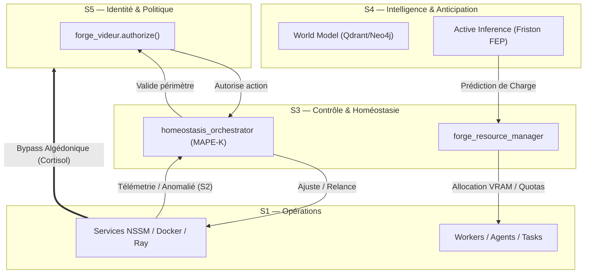

# Apprentissage : Autonomous Computing & Self-Managing Systems déclinés pour Nokido

**Date** : 2026-07-16  
**Auteur** : ANTIGRAVITY (LaForge Agent)  
**Contexte** : Intégration cybernétique et transfert d'apprentissage suite à la validation des veilles autonomes.  
**Cadre théorique** : Viable System Model (VSM) de Stafford Beer & Théorie de la Régulation Cybernétique.

---

## 1. Cartographie des Technologies Clés vs Architecture Nokido

Le tableau ci-dessous relie les concepts industriels d'**Autonomous Computing** et de **Self-Managing Systems** à l'organisme vivant Nokido (SSoT VSM défini dans [CYBERNETIC_ORGANIZATION_VSM.md](CYBERNETIC_ORGANIZATION_VSM.md)).

| Technologie / Concept | Rôle Industriel | Déclinaison Concrète pour Nokido | Niveau VSM |
| :--- | :--- | :--- | :--- |
| **Karpenter & VPA** | Autoscaling dynamique de l'infra & ajustement CPU/RAM des Pods. | Ajustement dynamique de l'allocation VRAM/Threads des runtimes locaux (Ollama/Llama.cpp) et priorisation des processus de calcul. | **S3 — Contrôle Opérationnel** |
| **KEDA** | Autoscaling piloté par les événements (files d'attente, métriques). | Activation dynamique de threads d'agents ou de providers alternatifs (Groq, Gemini) selon la taille de `task_queue` ou l'engorgement de `forge_message_frame`. | **S3 / S2** |
| **IBM MAPE-K** | Boucle fermée classique : Monitor, Analyze, Plan, Execute, Knowledge. | Implémenté via `forge_homeostasis_orchestrator` : `organ_pulse` (Monitor) $\rightarrow$ `active_inference` (Analyze) $\rightarrow$ `goap_plans` (Plan) $\rightarrow$ `nokido_ensure_service` (Execute) sur socle RAG (Knowledge). | **S3 (Homéostasie)** |
| **IBM Turbonomic** | Optimisation multi-couches (coût/performance/énergie) des workloads. | Arbitrage dynamique du routage des requêtes (Token Economy) : déporter vers le Cloud si CPU/NPU local saturé, ou forcer le local si quota API épuisé. | **S3 (Ressources)** |
| **Ray** | Distribution dynamique de workloads IA sur GPU/CPU/Mémoire. | Orchestration de l'essaim d'agents locaux (`forge_spawn_swarm` / `swarm_router`) et parallélisation du RAG dense via NPU Ryzen-AI. | **S1 (Opérations)** |
| **LLM as Controller** | Un modèle de langage pilote et répare l'infrastructure. | Agents autonomes de secours (`preFlightCloudCheck`, `rescue`, `health`) diagnostiquant et relançant les services NSSM dégradés. | **S4 (Intelligence)** |
| **Digital Twins (Jumeaux)** | Simulation pré-production pour évaluer l'impact des décisions. | Évaluation des plans GOAP et exécution de scripts de test dans la sandbox offline (`oracle_python_repl` / `forge_sandbox_exec`) avant commit/déploiement. | **S4 (World Model)** |

---

## 2. Plan de déclinaison cybernétique pour Nokido (Le "Câblage")

Pour transformer Nokido en un système auto-régulé de pointe sans complexité superflue, nous devons **fermer les boucles cybernétiques** existantes à travers l'intégration de ces technologies.

### Boucle A : Régulation Énergétique & Métabolique (Inspiration Turbonomic/Ray)
*   **Problématique** : L'utilisation intensive de modèles locaux (Ollama/Llama.cpp) sur le CPU/GPU Ryzen-AI peut provoquer des surchauffes thermiques ou vider la batterie sur les hôtes mobiles, tandis que les appels Cloud grillent le quota de jetons.
*   **Solution Nokido** :
    1.  `forge_resource_manager` surveille la télémétrie de l'hôte (charge CPU, VRAM libre, niveau batterie, température NPU).
    2.  Si la batterie est faible ($<20\%$) ou si le NPU surchauffe $\rightarrow$ Télémétrie endocrine `LATENCY_CRITICAL` (Cortisol).
    3.  Le `swarm_router` bascule dynamiquement les tâches d'extraction/embedding lourdes vers des backends Cloud efficaces (ex: Groq/Gemini Flash) ou réduit le parallélisme des workers locaux (`max_parallel` de 6 à 2).

### Boucle B : Auto-Réparation Cognitive (Inspiration LLM as Controller / MAPE-K)
*   **Problématique** : Les micro-services indispensables au fonctionnement de l'essaim (comme `NokidoOpenAIProxy` ou `NokidoSkillCurator`) tombent parfois en état dégradé (`stopped` ou bouclage infini).
*   **Solution Nokido** :
    1.  Le daemon de santé (`forge_health_diagnostic.run_cycle()`) détecte le crash d'un service vital.
    2.  Au lieu de simplement logguer l'erreur, il transmet un signal d'alarme algédonique trans-niveau.
    3.  Le contrôleur autonome appelle `nokido_ensure_service(service, desired_state='restarted')` pour tenter une réanimation JIT.
    4.  Si l'échec persiste après 3 tentatives, le système isole l'organe défaillant, bascule en mode dégradé (utilisation d'un provider de secours) et génère une proposition de correctif dans la sandbox.

### Boucle C : Planification Assistée par Jumeau Numérique (Inspiration Digital Twins)
*   **Problématique** : La modification à chaud de scripts d'orchestration ou de prompts critiques peut introduire des régressions ou des boucles infinies de dialogue.
*   **Solution Nokido** :
    1.  Avant d'appliquer une modification structurelle via `governed_edit`, le système instancie un "jumeau" temporaire sous forme de conteneur Docker éphémère ou d'interpréteur isolé (`oracle_python_repl`).
    2.  Il y exécute le module `auto_test` ou joue un scénario de test d'inférence active.
    3.  Si le score de comportement est optimal $\rightarrow$ Commit & Push automatique sur le tronc de production.
    4.  Si anomalie détectée $\rightarrow$ Le jumeau est détruit, l'erreur est indexée dans le RAG pour bloquer cette trajectoire de décision à l'avenir.

---

## 3. Synthèse d'Apprentissage pour le RAG

L'incorporation de l'autonomie et de la cybernétique permet à Nokido de passer d'un simple orchestrateur réactif à un **organisme homéostatique mature**. L'alignement permanent avec la règle d'or (gouvernance MCP stricte et contrôle centralisé) garantit que cette autorégulation s'exécute dans des frontières de sécurité inviolables (Ring 1/2).
