# PLAN_REFACTO.md — Nokido v16.2 → v17 (élagage)

*Mis à jour : 2026-04-16 (v2) | basé sur scan AST + racines virtuelles (Nokido.py, mcp_server_tools.py, bootstrap.py)*

## Évolution depuis v1

| Étape | Modules `forge_*` | Vrais orphelins | % code mort |
|-------|------------------:|----------------:|------------:|
| v1 (scan naïf) | 219 | 53 | 24% |
| **Après KILL (4 modules → `_attic/`)** | 215 | 49 | 23% |
| **Après scan corrigé (racines virtuelles)** | 215 (+3 nodes virt = 218) | **48** | **22%** |

**9 faux orphelins révélés** par le scan corrigé : `forge_state` (utilisé par `bootstrap.py`), `forge_agent_authority`, `forge_codeberg_sync`, `forge_github_mcp_connector`, `forge_gui_debug`, `forge_kaggle_bridge`, `forge_network`, `forge_runtime`, `forge_sentinel`.

## Plan de refacto — 6 destinations (mis à jour)

```mermaid
flowchart TD
    ORPHANS["48 vrais orphelins<br/>(22% du codebase, -5 vs v1)"]

    ORPHANS --> KILL["💀 KILL — déjà fait ✅<br/>(4 modules archivés _attic/)"]
    ORPHANS --> MERGE["🔀 MERGE — fusionner (5)"]
    ORPHANS --> TOOL["🛠 TOOL → tools/ctf/ (9)"]
    ORPHANS --> BENCH["📊 BENCH → tools/bench/ (9)"]
    ORPHANS --> RESEARCH["🧪 RESEARCH → tools/research/ (7)"]
    ORPHANS --> REVIVE["💉 REVIVE — brancher (3 trésors)"]
    ORPHANS --> INVEST["🔍 INVESTIGATE — lire (15)"]

    KILL -.-> KDONE[forge_banner ❌<br/>forge_help ❌<br/>batch_resolver_patch2 ❌<br/>ctf_runner_patch1 ❌]

    MERGE --> M1[logger + unified_logger<br/>→ unified_logger]
    MERGE --> M2[hub_storage + hub_worker<br/>→ hub]
    MERGE --> M3[brain_client → dispatch_ai]
    MERGE --> M4["⚠ code_guard ↔ forge_code<br/>(doublon migration partielle)"]

    REVIVE --> RV1["💎 sovereign_mapper 97L<br/>brancher avant litellm_call"]
    REVIVE --> RV2["💎 forge_state 346L<br/>FIX BUG constantes dupliquées<br/>(déjà actif via bootstrap.py)"]
    REVIVE --> RV3["💎 forge_registry 438L<br/>brancher dans handlers TUI"]

    TOOL --> T1[ctf_runner 708L]
    TOOL --> T2[ctf_autonomy 415L]
    TOOL --> T3[ctf_exploit_writer 350L]
    TOOL --> T4[payload_forge 523L]
    TOOL --> T5[handler_exegol 159L]
    TOOL --> T6[pwn_leak_parser 103L]
    TOOL --> T7[forge_exec 141L]
    TOOL --> T8[docker_orchestrator 262L]
    TOOL --> T9[gdb_live 288L]

    BENCH --> B1[longmemeval x3<br/>1445L]
    BENCH --> B2[snn + graph + ogb_arxiv<br/>1009L]
    BENCH --> B3[knowledge_distiller +<br/>dataset_loader + domain_adapter<br/>841L]

    RESEARCH --> R1[gnn 376L]
    RESEARCH --> R2[graph_engine 322L]
    RESEARCH --> R3[onnx_genai 384L]
    RESEARCH --> R4[native_bridge 329L]
    RESEARCH --> R5[spike_router_lite 168L]
    RESEARCH --> R6[inhibition_bus 327L]
    RESEARCH --> R7[distribution 445L]

    INVEST --> I1["forge_trauma_vault, vec_ledger,<br/>cascade_oracle, mutation_cache,<br/>safe_integration, sanitizer_analyst,<br/>noise_inject, prompt_builder,<br/>idle_watchdog, thought_interceptor,<br/>batch_resolver, adr_rag_sync,<br/>deepseek_bridge, github_intel, git_worker"]

    classDef done fill:#1a3a1a,stroke:#4caf50,color:#4caf50,stroke-dasharray:5 5
    classDef kill fill:#3a1a1a,stroke:#f44336,color:#f44336
    classDef merge fill:#3a2a1a,stroke:#ff9800,color:#ff9800
    classDef revive fill:#2a3a2a,stroke:#00e676,color:#00e676,stroke-width:3px
    classDef tool fill:#1a2a1a,stroke:#4caf50,color:#4caf50
    classDef bench fill:#1a2a3a,stroke:#2196f3,color:#2196f3
    classDef research fill:#2a1a3a,stroke:#b388ff,color:#b388ff
    classDef invest fill:#3a3a1a,stroke:#ffeb3b,color:#ffeb3b
    classDef root fill:#222,stroke:#aaa,color:#fff

    class ORPHANS root
    class KILL,KDONE done
    class MERGE,M1,M2,M3,M4 merge
    class REVIVE,RV1,RV2,RV3 revive
    class TOOL,T1,T2,T3,T4,T5,T6,T7,T8,T9 tool
    class BENCH,B1,B2,B3 bench
    class RESEARCH,R1,R2,R3,R4,R5,R6,R7 research
    class INVEST,I1 invest
```

## Changements vs v1

### ✅ KILL (4) — DÉJÀ FAIT

| Module | Statut |
|--------|--------|
| `forge_banner` | ✅ → `app/_attic/` |
| `forge_help` | ✅ → `app/_attic/` |
| `forge_batch_resolver_patch2` | ✅ → `app/_attic/` |
| `forge_ctf_runner_patch1` | ✅ → `app/_attic/` |

Manifest : `app/_attic/KILL_20260416_105323.txt`. Régression : 0.

### 💉 NOUVEAU bucket REVIVE (3) — extraits de INVESTIGATE

3 modules sont **trop bons pour mourir**, identifiés à l'étape A précédente :

| Module | Taille | Action |
|--------|-------:|--------|
| `forge_sovereign_mapper` | 97L | Brancher dans `forge_llamacpp` ou `litellm_bridge` avant tout `call()` cloud — `wrap_input()` / `unwrap_output()` |
| `forge_state` | 346L | **FIX BUG** : constantes `_T_BOOL/_T_INT/_T_STR/_T_EMPTY` dupliquées 3× avec valeurs **différentes** (lignes 79-82, 88-91, 93-96). Module **déjà actif** via `bootstrap.py` → bug en prod silencieux |
| `forge_registry` | 438L | Brancher comme backend des handlers `@workflow`, `@ci`, `@chain`, `@switch`, `@scan`, `@ids` (déjà appelé dans le code des handlers ?) |

### 🔀 MERGE — un cas critique ajouté

| Cible | Source | Justification |
|-------|--------|---------------|
| `forge_code` (gardé) | `forge_code_guard` (à mort) | **Doublon de migration partielle**. `forge_code.py` est importé par 7 modules, `forge_code_guard.py` par 0. Mais `forge_code_guard` semble plus récent (refactor en cours ?). Décision en option C |

### 🔍 INVESTIGATE — réduit de 19 à 15

Sortis du bucket : `forge_sovereign_mapper`, `forge_state`, `forge_registry`, `forge_code_guard` (déplacés vers REVIVE/MERGE).

Restent : 15 modules à lire en stub mode pour verdict final.

## Impact estimé (mis à jour)

| Action | Modules | Lignes | % codebase | Statut |
|--------|--------:|-------:|-----------:|--------|
| ✅ KILL | 4 | 210 | 0.3% | **FAIT** |
| 💉 REVIVE | 3 | 881 | 1.3% | À faire |
| 🔀 MERGE | 5 | 913 | 1.3% | À planifier |
| 🛠 TOOL → /tools/ctf/ | 9 | 2 949 | 4.2% | À déplacer |
| 📊 BENCH → /tools/bench/ | 9 | 3 295 | 4.7% | À déplacer |
| 🧪 RESEARCH → /tools/research/ | 7 | 2 351 | 3.4% | À déplacer |
| 🔍 INVESTIGATE | 15 | ~4 600 | 6.5% | À lire |
| **TOTAL** | **52** | **~15 200** | **~22%** | — |

## 📦 Artefacts

- `sandbox/refacto_orphans.json` — classification heuristique v1
- `sandbox/refacto_classification.json` — croisement Nokido.py / mcp_tools v1
- `sandbox/refacto_verdicts.json` — verdict par module v1
- `sandbox/orphans_after_C.json` — orphelins corrigés (scan v2 avec racines virtuelles)
- `app/_attic/KILL_20260416_105323.txt` — manifest des suppressions
