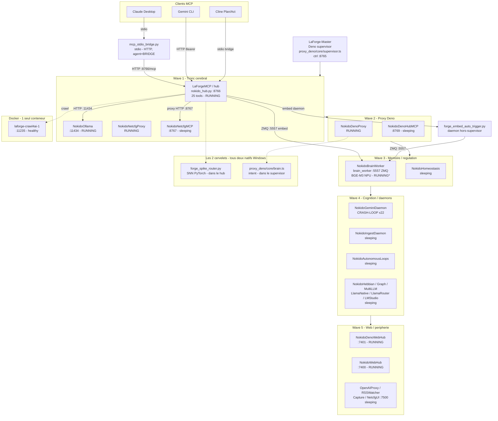

# Nokido — Topologie runtime

<!-- ports-arretes -->
> ⚠️ **Ports arrêtés cités dans cette page** (note ajoutée le 2026-08-30 ; le corps ci-dessous n'a pas été réécrit) :
>
> - `brain_worker :5557` est **arrete depuis le 2026-06-03** (OOM ONNX BGE-M3) — l'embedder vivant est `:8099` (BGE-M3 GGUF llama.cpp).

Vue **processus / services / ports** — complémentaire de la carte anatomique
(`CLAUDE.md` §10, organes → modules). Ici : ce qui tourne réellement, qui
supervise quoi, sur quel port.

Source : `proxy_deno/core/supervisor.ts` (SERVICES + waves) + endpoint live
`GET http://127.0.0.1:8765/supervisor/status`. Snapshot **2026-05-20**.

## Diagramme

## Notes

- **`RUNNING*`** (brain_worker) : réveillé manuellement le 2026-05-20. Bug
  connu — stalle après ~1 sub-batch de charge soutenue (voir backlog embed).
- **`CRASH-LOOP x22`** : `NokidoGeminiDaemon` — refuse de démarrer, PID file
  `sandbox/gemini_poll_daemon.pid` contesté.
- **`sleeping`** : mis en veille par politique wave du supervisor (pas RAM —
  mesurée à 56 %). Réveil : `POST :8765/supervisor/wake/<nom>`.
- **Pas de cerveau Docker.** Docker = uniquement `crawl4ai`. Les 2 cervelets
  (`forge_spike_router.py` SNN + `brain.ts` intent) tournent natifs Windows.

## Contrôle supervisor (:8765)

| Endpoint | Effet |
|---|---|
| `GET /supervisor/status` | État de tous les services |
| `POST /supervisor/restart/<nom>` | kill SIGTERM + respawn |
| `POST /supervisor/wake/<nom>` | réveil d'un service sleeping |
| `POST /supervisor/sleep/<nom>` | mise en veille |
| `GET /supervisor/logs?name=<nom>` | tail du log service |

Service du hub = **`LaForgeMCP`**. Restart sanctionné (règle #10 CLAUDE.md) :
`POST :8765/supervisor/restart/LaForgeMCP` — pas de `nssm` direct.
