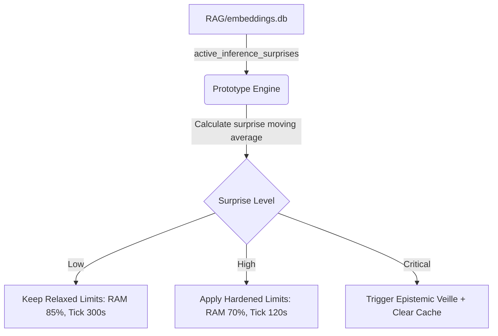

# Design Document: Adaptive Homeostatic Regulation via Variational Free Energy

**Author**: `ANTIGRAVITY`  
**Date**: 2026-07-26  
**Status**: Proposal (Design + Non-Intrusive Prototype)  
**Target Area**: Homeostasis (`forge_homeostasis_orchestrator.py` + `forge_active_inference.py`)  

---

## 1. Executive Summary
This document proposes a neuro-symbolic framework for adaptive homeostatic regulation in Nokido based on Karl Friston's **Free Energy Principle (FEP)**. 

By linking the prediction error (surprise) of Nokido's existing World Model (`forge_active_inference.py`) to the thresholds of the Homeostasis Orchestrator (`forge_homeostasis_orchestrator.py`), the system dynamically shifts its defensive posture (e.g., RAM limits, tick frequencies, resource eviction policies) when encountering highly unexpected environmental states or execution failures.

---

## 2. Theoretical Framework (Active Inference)

In FEP, a self-organizing system maintains its structural integrity by minimizing **Variational Free Energy (F)**, which acts as an upper bound on **Surprise**:

$$F \approx \text{Surprise} + \text{Complexity Cost}$$

In Nokido:
- **Prior beliefs** $P(o | m, t)$ are maintained for actions (methods $m$ on targets $t$ yielding outcomes $o$).
- **Surprise** is computed whenever an actual outcome deviates from predictions (e.g., unexpected execution time, RAM spikes, or failure).
- **Homeostatic Posture**: When surprise is low ($F \approx 0$), the system is operating in a predictable regime. We can run with relaxed limits. When surprise is high ($F \gg 0$), the system is in an unstable or unknown state; it must harden its limits to avoid crashes and increase observation frequency (active sensing).

---

## 3. Dynamic Threshold Mapping

Let $S_{avg}$ be the moving average of surprise over the last $N$ actions:

1. **Adaptive RAM Limit ($\theta_{RAM}$)**:
   Normally set to `LAFORGE_HOMEO_RAM_SLEEP_PCT` (default: 85%). Under high surprise, the threshold drops to protect the machine:
   $$\theta_{RAM} = \max(\theta_{min}, \theta_0 - \alpha \cdot S_{avg})$$
   where $\theta_0 = 85\%$, $\theta_{min} = 65\%$, and $\alpha$ is a sensitivity coefficient.

2. **Adaptive Tick Interval ($\tau_{tick}$)**:
   Normally set to 300s (5 minutes). Under high surprise, the interval decreases to execute faster checks:
   $$\tau_{tick} = \max(\tau_{min}, \frac{\tau_0}{1 + \beta \cdot S_{avg}})$$
   where $\tau_0 = 300\text{s}$, $\tau_{min} = 60\text{s}$, and $\beta$ is a sensitivity coefficient.

3. **Active Epistemic Drive (Soif de Connaissance)**:
   If $S_{avg} > \text{Threshold}_{epistemic}$, trigger an automatic active inference cycle (`forge_epistemic_veille.py`) to resolve the model mismatch.

---

## 4. Prototype Architecture

A non-intrusive prototype `tools/forge_active_inference_homeostat_prototype.py` reads the SQLite `active_inference_surprises` table in `embeddings.db`, computes the adaptive values, and outputs them without mutating the core:

---

## 5. Next Steps for Implementation (Requires Owner Approval)
1. Integrate the prototype calculations into the tick loop of `forge_homeostasis_orchestrator.py`.
2. Apply the dynamic `RAM_SLEEP_PCT` directly to process eviction thresholds.
3. Validate performance under simulated high-variance workloads.
