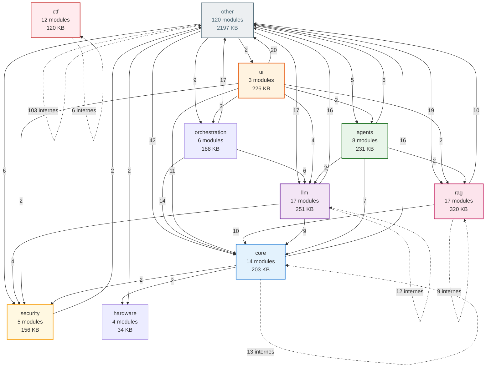

```mermaid
graph TD
    %% Nokido - Graphe des dependances inter-categories (macro vue)
    %% Nombre = nb d'imports cross-category
    other["other<br/>120 modules<br/>2197 KB"]
    rag["rag<br/>17 modules<br/>320 KB"]
    llm["llm<br/>17 modules<br/>251 KB"]
    core["core<br/>14 modules<br/>203 KB"]
    ctf["ctf<br/>12 modules<br/>120 KB"]
    agents["agents<br/>8 modules<br/>231 KB"]
    orchestration["orchestration<br/>6 modules<br/>188 KB"]
    security["security<br/>5 modules<br/>156 KB"]
    hardware["hardware<br/>4 modules<br/>34 KB"]
    ui["ui<br/>3 modules<br/>226 KB"]

    %% Edges (>= 2 imports)
    other -->|42| core
    ui -->|20| other
    other -->|19| rag
    other -->|17| llm
    orchestration -->|17| other
    core -->|16| other
    llm -->|16| other
    orchestration -->|14| core
    ui -->|11| core
    rag -->|10| core
    rag -->|10| other
    other -->|9| orchestration
    llm -->|9| core
    agents -->|7| core
    agents -->|6| other
    orchestration -->|6| llm
    other -->|6| security
    other -->|5| agents
    ui -->|4| llm
    llm -->|4| security
    ui -->|3| orchestration
    ui -->|2| security
    ui -->|2| rag
    ui -->|2| agents
    core -->|2| security
    core -->|2| hardware
    other -->|2| hardware
    other -->|2| ui
    agents -->|2| rag
    agents -->|2| llm
    security -->|2| other

    %% Couplage interne (self-loops)
    other -.->|103 internes| other
    core -.->|13 internes| core
    llm -.->|12 internes| llm
    rag -.->|9 internes| rag
    ctf -.->|6 internes| ctf

    classDef core fill:#e3f2fd,stroke:#1976d2,stroke-width:2px
    classDef ui fill:#fff3e0,stroke:#e65100,stroke-width:2px
    classDef llm fill:#f3e5f5,stroke:#6a1b9a,stroke-width:2px
    classDef agents fill:#e8f5e9,stroke:#2e7d32,stroke-width:2px
    classDef rag fill:#fce4ec,stroke:#c2185b,stroke-width:2px
    classDef ctf fill:#ffebee,stroke:#c62828,stroke-width:2px
    classDef security fill:#fff8e1,stroke:#f9a825,stroke-width:2px
    classDef other fill:#eceff1,stroke:#546e7a,stroke-width:1px,color:#546e7a
    
    class core core
    class ui ui
    class llm llm
    class agents agents
    class rag rag
    class ctf ctf
    class security security
    class other other
```