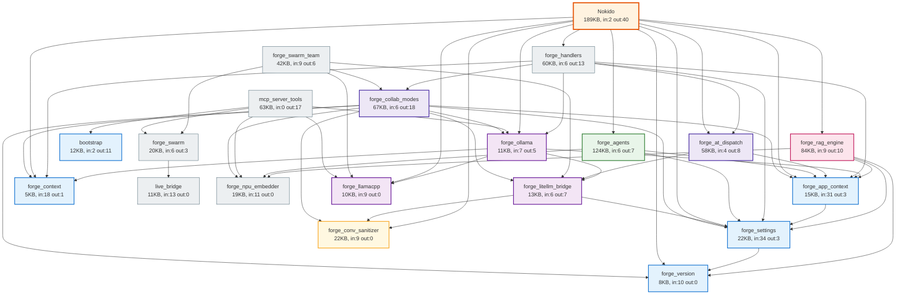

```mermaid
graph TD
    %% Nokido - Top 20 hubs (fan-in + fan-out)
    %% Label: nom(sizeKB)[in=X,out=Y]

    fsettings["forge_settings<br/>22KB, in:34 out:3"]:::core
    fappcontext["forge_app_context<br/>15KB, in:31 out:3"]:::core
    Nokido["Nokido<br/>189KB, in:2 out:40"]:::ui
    fcontext["forge_context<br/>5KB, in:18 out:1"]:::core
    fcollabmodes["forge_collab_modes<br/>67KB, in:6 out:18"]:::orchestration
    fragengine["forge_rag_engine<br/>84KB, in:9 out:10"]:::rag
    livebridge["live_bridge<br/>11KB, in:13 out:0"]:::other
    fhandlers["forge_handlers<br/>60KB, in:6 out:13"]:::other
    fswarmteam["forge_swarm_team<br/>42KB, in:9 out:6"]:::other
    fnpuembedder["forge_npu_embedder<br/>19KB, in:11 out:0"]:::other
    fversion["forge_version<br/>8KB, in:10 out:0"]:::core
    fagents["forge_agents<br/>124KB, in:6 out:7"]:::agents
    flitellmbrid["forge_litellm_bridge<br/>13KB, in:6 out:7"]:::llm
    follama["forge_ollama<br/>11KB, in:7 out:5"]:::llm
    fconvsanitiz["forge_conv_sanitizer<br/>22KB, in:9 out:0"]:::security
    fllamacpp["forge_llamacpp<br/>10KB, in:9 out:0"]:::llm
    mcpservertoo["mcp_server_tools<br/>63KB, in:0 out:17"]:::other
    fatdispatch["forge_at_dispatch<br/>58KB, in:4 out:8"]:::orchestration
    bootstrap["bootstrap<br/>12KB, in:2 out:11"]:::core
    fswarm["forge_swarm<br/>20KB, in:6 out:3"]:::other

    %% Edges entre top hubs uniquement
    fcollabmodes --> fconvsanitiz
    fcollabmodes --> fnpuembedder
    fcollabmodes --> flitellmbrid
    fcollabmodes --> fsettings
    fcollabmodes --> fappcontext
    fcollabmodes --> fcontext
    fcollabmodes --> fversion
    fcollabmodes --> follama
    mcpservertoo --> fnpuembedder
    mcpservertoo --> fswarm
    mcpservertoo --> fllamacpp
    mcpservertoo --> bootstrap
    mcpservertoo --> follama
    fswarmteam --> fswarm
    fswarmteam --> flitellmbrid
    fswarmteam --> fllamacpp
    fswarmteam --> fcollabmodes
    flitellmbrid --> fconvsanitiz
    flitellmbrid --> fsettings
    Nokido --> fhandlers
    Nokido --> fappcontext
    Nokido --> fcontext
    Nokido --> fllamacpp
    Nokido --> fragengine
    Nokido --> fconvsanitiz
    Nokido --> fsettings
    Nokido --> fatdispatch
    Nokido --> follama
    Nokido --> fagents
    Nokido --> fversion
    fagents --> fnpuembedder
    fagents --> fappcontext
    fagents --> fsettings
    fatdispatch --> flitellmbrid
    fatdispatch --> fappcontext
    fhandlers --> fatdispatch
    fhandlers --> fcollabmodes
    fhandlers --> fappcontext
    fhandlers --> fcontext
    fhandlers --> follama
    fhandlers --> fsettings
    fsettings --> fversion
    follama --> flitellmbrid
    follama --> fllamacpp
    follama --> fappcontext
    follama --> fcontext
    fappcontext --> fsettings
    fswarm --> livebridge
    fragengine --> fnpuembedder
    fragengine --> fsettings
    fragengine --> fappcontext
    fragengine --> fversion

    classDef core fill:#e3f2fd,stroke:#1976d2,stroke-width:2px
    classDef ui fill:#fff3e0,stroke:#e65100,stroke-width:3px
    classDef llm fill:#f3e5f5,stroke:#6a1b9a,stroke-width:2px
    classDef agents fill:#e8f5e9,stroke:#2e7d32,stroke-width:2px
    classDef rag fill:#fce4ec,stroke:#c2185b,stroke-width:2px
    classDef ctf fill:#ffebee,stroke:#c62828,stroke-width:2px
    classDef security fill:#fff8e1,stroke:#f9a825,stroke-width:2px
    classDef orchestration fill:#ede7f6,stroke:#4527a0,stroke-width:2px
    classDef hardware fill:#e0f2f1,stroke:#00695c,stroke-width:2px
    classDef other fill:#eceff1,stroke:#546e7a,stroke-width:1px
```