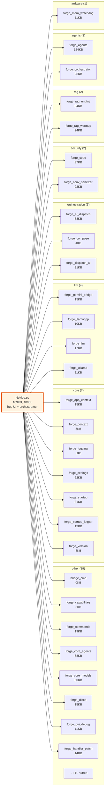

```mermaid
graph LR
    %% Nokido.py (189KB) - zoom sur ses dependances directes
    %% Centre = Nokido, rayons = modules importes

    Nokido["Nokido.py<br/>189KB, 4890L<br/>hub UI + orchestrateur"]:::ui

    subgraph other["other (19)"]
        bridgecmd["bridge_cmd<br/>0KB"]
        fcapabilities["forge_capabilities<br/>3KB"]
        fcommands["forge_commands<br/>19KB"]
        fcoreagents["forge_core_agents<br/>68KB"]
        fcoremodels["forge_core_models<br/>60KB"]
        fdisco["forge_disco<br/>15KB"]
        fguidebug["forge_gui_debug<br/>11KB"]
        fhandlerpatch["forge_handler_patch<br/>14KB"]
        other_more["... +11 autres"]
    end

    subgraph core["core (7)"]
        fappcontext["forge_app_context<br/>15KB"]
        fcontext["forge_context<br/>5KB"]
        flogging["forge_logging<br/>5KB"]
        fsettings["forge_settings<br/>22KB"]
        fstartup["forge_startup<br/>31KB"]
        fstartuplogger["forge_startup_logger<br/>13KB"]
        fversion["forge_version<br/>8KB"]
    end

    subgraph llm["llm (4)"]
        fgeminibridge["forge_gemini_bridge<br/>15KB"]
        fllamacpp["forge_llamacpp<br/>10KB"]
        fllm["forge_llm<br/>17KB"]
        follama["forge_ollama<br/>11KB"]
    end

    subgraph orchestration["orchestration (3)"]
        fatdispatch["forge_at_dispatch<br/>58KB"]
        fcompose["forge_compose<br/>4KB"]
        fdispatchai["forge_dispatch_ai<br/>31KB"]
    end

    subgraph security["security (2)"]
        fcode["forge_code<br/>97KB"]
        fconvsanitizer["forge_conv_sanitizer<br/>22KB"]
    end

    subgraph rag["rag (2)"]
        fragengine["forge_rag_engine<br/>84KB"]
        fragwarmup["forge_rag_warmup<br/>24KB"]
    end

    subgraph agents["agents (2)"]
        fagents["forge_agents<br/>124KB"]
        forchestrator["forge_orchestrator<br/>26KB"]
    end

    subgraph hardware["hardware (1)"]
        fmemwatchdog["forge_mem_watchdog<br/>11KB"]
    end

    Nokido --> bridgecmd
    Nokido --> fcapabilities
    Nokido --> fcommands
    Nokido --> fcoreagents
    Nokido --> fcoremodels
    Nokido --> fdisco
    Nokido --> fguidebug
    Nokido --> fhandlerpatch
    Nokido --> fcode
    Nokido --> fconvsanitizer
    Nokido --> fragengine
    Nokido --> fragwarmup
    Nokido --> fatdispatch
    Nokido --> fcompose
    Nokido --> fdispatchai
    Nokido --> fappcontext
    Nokido --> fcontext
    Nokido --> flogging
    Nokido --> fsettings
    Nokido --> fstartup
    Nokido --> fstartuplogger
    Nokido --> fversion
    Nokido --> fgeminibridge
    Nokido --> fllamacpp
    Nokido --> fllm
    Nokido --> follama
    Nokido --> fagents
    Nokido --> forchestrator
    Nokido --> fmemwatchdog

    classDef core fill:#e3f2fd,stroke:#1976d2
    classDef ui fill:#fff3e0,stroke:#e65100,stroke-width:3px
    classDef llm fill:#f3e5f5,stroke:#6a1b9a
    classDef agents fill:#e8f5e9,stroke:#2e7d32
    classDef rag fill:#fce4ec,stroke:#c2185b
    classDef security fill:#fff8e1,stroke:#f9a825
    classDef orchestration fill:#ede7f6,stroke:#4527a0
    classDef other fill:#eceff1,stroke:#546e7a
```