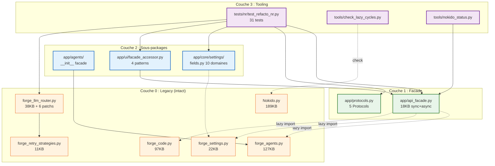

# Mermaid - Nouveaux modules et leurs dependances

```mermaid
graph TD
    subgraph L0["Couche 0 : Legacy (intact)"]
        LForge["Nokido.py<br/>189KB"]
        fagents["forge_agents.py<br/>127KB"]
        fsettings["forge_settings.py<br/>22KB"]
        fcode["forge_code.py<br/>97KB"]
        fretry["forge_retry_strategies.py<br/>11KB"]
        frouter["forge_llm_router.py<br/>38KB + 6 patchs"]
    end
    
    subgraph L1["Couche 1 : Facade"]
        api_facade["app/api_facade.py<br/>18KB sync+async"]
        protocols["app/protocols.py<br/>5 Protocols"]
    end
    
    subgraph L2["Couche 2 : Sous-packages"]
        agents_pkg["app/agents/<br/>__init__ facade"]
        core_settings["app/core/settings/<br/>fields.py 10 domaines"]
        ui_accessor["app/ui/facade_accessor.py<br/>4 patterns"]
    end
    
    subgraph L3["Couche 3 : Tooling"]
        nr_test["tests/nr/test_refacto_nr.py<br/>31 tests"]
        linter["tools/check_lazy_cycles.py"]
        status_cli["tools/nokido_status.py"]
    end
    
    api_facade -.lazy import.-> fagents
    api_facade -.lazy import.-> fsettings
    api_facade -.lazy import.-> fcode
    agents_pkg --> fagents
    core_settings -.-> fsettings
    ui_accessor --> api_facade
    frouter --> fretry
    
    nr_test --> api_facade
    nr_test --> protocols
    nr_test --> core_settings
    nr_test --> ui_accessor
    nr_test --> frouter
    status_cli --> api_facade
    linter -.check.-> LForge
    
    classDef legacy fill:#fff3e0,stroke:#e65100,stroke-width:1px
    classDef facade fill:#e8f5e9,stroke:#2e7d32,stroke-width:2px
    classDef subpkg fill:#e3f2fd,stroke:#1565c0,stroke-width:2px
    classDef tool fill:#f3e5f5,stroke:#6a1b9a,stroke-width:2px
    
    class LForge,fagents,fsettings,fcode,fretry,frouter legacy
    class api_facade,protocols facade
    class agents_pkg,core_settings,ui_accessor subpkg
    class nr_test,linter,status_cli tool
```