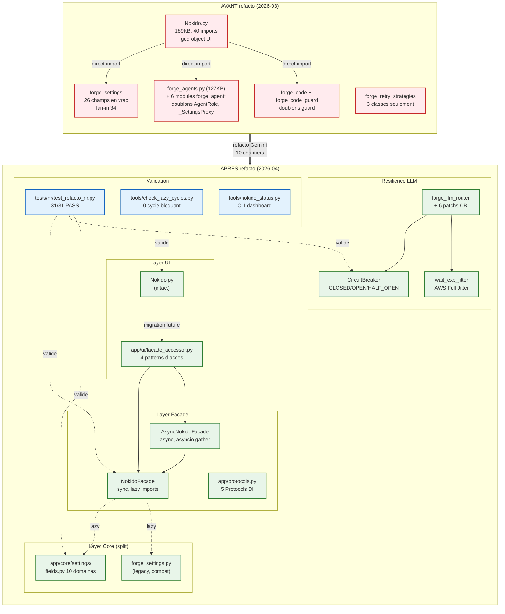

# Mermaid - Architecture post-refacto 2026-04

Comparaison visuelle AVANT / APRES les 10 chantiers refacto.

```mermaid
graph TB
    subgraph BEFORE["AVANT refacto (2026-03)"]
        direction TB
        LF_old["Nokido.py<br/>189KB, 40 imports<br/>god object UI"]
        settings_old["forge_settings<br/>26 champs en vrac<br/>fan-in 34"]
        retry_old["forge_retry_strategies<br/>3 classes seulement"]
        code_old["forge_code + forge_code_guard<br/>doublons guard"]
        agents_old["forge_agents.py (127KB)<br/>+ 6 modules forge_agent*<br/>doublons AgentRole, _SettingsProxy"]
        
        LF_old -->|direct import| settings_old
        LF_old -->|direct import| agents_old
        LF_old -->|direct import| code_old
    end

    subgraph AFTER["APRES refacto (2026-04)"]
        direction TB
        
        subgraph UI_LAYER["Layer UI"]
            LF_new["Nokido.py<br/>(intact)"]
            accessor["app/ui/facade_accessor.py<br/>4 patterns d acces"]
        end
        
        subgraph FACADE_LAYER["Layer Facade"]
            facade_sync["NokidoFacade<br/>sync, lazy imports"]
            facade_async["AsyncNokidoFacade<br/>async, asyncio.gather"]
            protocols["app/protocols.py<br/>5 Protocols DI"]
        end
        
        subgraph CORE_LAYER["Layer Core (split)"]
            settings_new["app/core/settings/<br/>fields.py 10 domaines"]
            settings_old2["forge_settings.py<br/>(legacy, compat)"]
        end
        
        subgraph RESILIENCE["Resilience LLM"]
            cb["CircuitBreaker<br/>CLOSED/OPEN/HALF_OPEN"]
            jitter["wait_exp_jitter<br/>AWS Full Jitter"]
            router["forge_llm_router<br/>+ 6 patchs CB"]
        end
        
        subgraph TESTS["Validation"]
            nr_tests["tests/nr/test_refacto_nr.py<br/>31/31 PASS"]
            linter["tools/check_lazy_cycles.py<br/>0 cycle bloquant"]
            status_cli["tools/nokido_status.py<br/>CLI dashboard"]
        end
        
        accessor --> facade_sync
        accessor --> facade_async
        facade_sync -.lazy.-> settings_new
        facade_sync -.lazy.-> settings_old2
        facade_async --> facade_sync
        router --> cb
        router --> jitter
        
        LF_new -.->|migration future| accessor
        nr_tests -.valide.-> facade_sync
        nr_tests -.valide.-> cb
        nr_tests -.valide.-> settings_new
        linter -.valide.-> LF_new
    end

    BEFORE ==>|refacto Gemini<br/>10 chantiers| AFTER

    classDef oldBox fill:#ffebee,stroke:#c62828,stroke-width:2px
    classDef newBox fill:#e8f5e9,stroke:#2e7d32,stroke-width:2px
    classDef testBox fill:#e3f2fd,stroke:#1565c0,stroke-width:2px
    
    class LF_old,settings_old,retry_old,code_old,agents_old oldBox
    class LF_new,accessor,facade_sync,facade_async,protocols,settings_new,settings_old2,cb,jitter,router newBox
    class nr_tests,linter,status_cli testBox
```