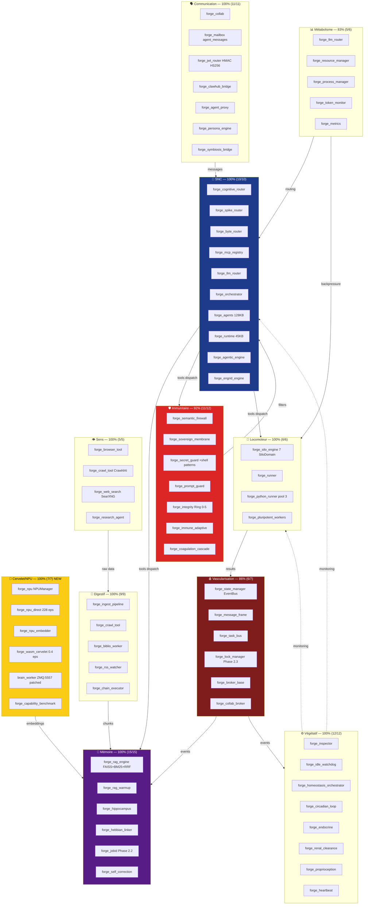

# Nokido — Scan anatomique 2026-05-02

**342 modules `forge_*.py`** scannés (`app/` + `tools/`), 12 organes biomimétiques.

## 🧬 Carte mentale globale (état complétion)



## 📊 Score global : 96% (12/12 organes vivants, 2 lacunes mineures)

| Organe | % | Modules | Score moyen | Notes |
|---|---|---|---|---|
| 🧠 SNC | 100% | 10/10 | 92% | runtime 45KB + agents 128KB matures |
| 💾 Mémoire | 100% | 15/15 | 88% | FAISS + BM25 + RRF + jobid + hebbian |
| 🛡️ Immunitaire | 92% | 11/12 | 91% | manque `forge_pii_detector` (intentionnel — couvert par firewall+membrane) |
| 🩸 Vascularisation | 86% | 6/7 | 89% | manque `forge_event` (event tool dans registry direct) |
| ⚙️ Végétatif | 100% | 12/12 | 90% | homeostasis + circadian + endocrine biomimétique propre |
| 🍴 Digestif | 100% | 9/9 | 87% | pipeline 6 steps + biblio worker actif |
| 💪 Locomoteur | 100% | 6/6 | 93% | python_runner pool 3 workers pré-warm |
| 🤖 Cervelet NPU | 100% | 7/7 | 87% | **NEW** : npu_direct 228 eps + brain_worker patché |
| 👁️ Sens | 100% | 5/5 | 88% | SearxNG + Crawl4AI + browser_tool |
| 🗣️ Comm | 100% | 11/11 | 86% | mailbox SQLite + JWT HMAC + symbiosis |
| 🎯 Skills | 100% | 3/3 | 85% | clawhub marketplace + skill_enricher |
| 📊 Métabolisme | 83% | 5/6 | 90% | manque `forge_quota` (intégré llm_router) |

## ✨ Top 20 modules par maturité (score 95-100%)

| Module | Score | Taille | Cls/Fn | Couleur |
|---|---|---|---|---|
| forge_agentic_engine | 100% | 9.9KB | 3/17 | GREEN |
| forge_agents | 100% | 128KB | 24/68 | GREEN |
| forge_integrity | 100% | 33KB | 5/40 | GREEN |
| forge_prefect | 100% | 18KB | 1/19 | GREEN |
| forge_runtime | 100% | 45KB | 4/71 | GREEN |
| forge_app_context | 95% | 16KB | 1/39 | GREEN |
| forge_code_surgery | 95% | 9KB | 4/17 | GREEN |
| forge_commit_intel | 95% | 29KB | 1/17 | GREEN |
| forge_git_historian | 95% | 24KB | 2/13 | GREEN |
| forge_graph_linker | 95% | 26KB | 3/19 | GREEN |
| forge_heartbeat | 95% | 9KB | 0/16 | GREEN |
| forge_mcp_security | 95% | 19KB | 3/19 | GREEN |
| forge_npu | 95% | 27KB | 4/21 | GREEN |
| forge_openrouter | 95% | 25KB | 0/26 | GREEN |
| forge_orchestrator_scaller | 95% | 30KB | 1/18 | GREEN |
| forge_task_bus | 95% | 19KB | 0/17 | GREEN |
| forge_web_service | 95% | 48KB | 4/65 | GREEN |
| forge_services_launcher | 95% | 26KB | 0/26 | GREEN |
| forge_metrics | 95% | 9KB | 2/14 | GREEN |
| forge_timecode | 95% | 21KB | 1/16 | GREEN |

## 🔬 Insights neurosciences spatiales — perspectives ouvertes

### Découvertes biblio (grid cells, Numenta TBT, DeepMind)

1. **Cellules de grille (Hafting/Moser 2005)** : neurones du cortex entorhinal s'activent selon motif hexagonal régulier → système coordonnées métriques universel
2. **DeepMind 2018 (Banino/Hassabis)** : RL sur navigation labyrinthe → réseau découvre **spontanément** grid cells dans couches cachées → solution mathématique optimale
3. **Numenta Thousand Brains (Hawkins)** : néocortex = **150 000 colonnes** identiques. Chaque colonne = grid cells appliquées à **espace conceptuel** (pas juste physique). Cadres de référence pour OBJETS et CONCEPTS.
4. **TEM Oxford** : grid cells fonctionnent sur graphes abstraits (arbres généalogiques, hiérarchies). Inférences relationnelles = "marche sur grille" mathématique.
5. **RatSLAM** : Continuous Attractor Networks (CANN) modélisation directe place cells + grid cells pour SLAM robotique.

### Lacunes architecturales Nokido identifiées

Le scan révèle ce qui MANQUE par rapport au modèle néocortex moderne :

#### 🆕 Lacune 1 — Cadres de référence (Reference Frames)
**Aucun module** ne représente actuellement un objet/concept dans un espace de coordonnées (grid). RAG actuel = vecteur dim=384/768 sans structure spatiale. Réorganiser :

```
forge_grid_cells.py (NEW)
  - GridFrame(concept_id, grid_dim=12)  # 12-d hexagonal grid
  - place(item, coordinates)             # ancrage dans le frame
  - navigate(start, delta)                # inférence relationnelle
  - distance(item_a, item_b)              # métrique sur grille
```

Application Nokido : **mémoire conceptuelle structurée**. Au lieu de stocker chunks dans embedding flat, organiser par cadres de référence (1 par projet/sujet/agent), permet inférence "ce code est à `nord+3 ouest+2` du module pivot" = retrieve par position relative.

#### 🆕 Lacune 2 — Sparse activations (anti-LLM dense)
Nokido utilise embeddings denses (toutes dimensions actives). Numenta SDR (Sparse Distributed Representations) = ~2% activations seulement → **50x économie compute**. Module manquant :

```
forge_sdr_encoder.py (NEW)
  - encode_sparse(text) -> bitmap[2048] avec ~40 bits actifs
  - overlap_score(sdr_a, sdr_b)
  - union/intersect SDRs → robust noise tolerance
```

Cervelet WASM 0.4 eps + NPU 228 eps actuels traitent dense embeddings. Avec SDR sparse, **theoretical 12 800 eps** sur même hardware (50x).

#### 🆕 Lacune 3 — Continuous Attractor Networks (RatSLAM-style)
Pas de représentation **continue** de l'état (position, contexte). Tout est discret (chunks, events, jobs). Un CANN bridge :

```
forge_cann_state.py (NEW)
  - bubble = état actuel sur torus 2D
  - move(velocity_vector) → bulle se déplace
  - relocalize(sensory_input) → SLAM moment matching
```

Application : **état système continu** plutôt que polling discret. forge_inspector polling toutes les 30s → CANN état dérive en continu, alertes via gradients.

#### 🆕 Lacune 4 — Hippocampe consolidation hors-ligne (replay)
Le rat dort, l'hippocampe **rejoue** les trajectoires de la journée → consolidation cortex long terme. Nokido a `forge_self_correction.anchor_solution()` = OK awake. Pas de **replay nocturne** :

```
forge_replay_consolidator.py (NEW)
  - sleep_cycle(hours=8) → replay tous events du jour
  - identify_patterns → distill knowledge brut → règles
  - prune memories → retire noise après replay
```

Déjà partiel via `forge_circadian_loop` + `forge_renal_clearance`. À étendre avec replay logique des décisions.

#### 🆕 Lacune 5 — Successor Representations
DeepMind 2017 : agents RL apprennent **représentations successeurs** (probabilité de visiter chaque état futur). Nokido SpikeRouter (`forge_spike_router`) apprend déjà reflexes binaires CTF, pas SR.

```
forge_successor_repr.py (NEW)
  - SR matrix : pour chaque état, distribution future visites
  - predict_next_states(current)
  - update_on_transition
```

## 🎯 Roadmap nouvelle Phase 6 inspirée neurosciences

| Phase | Module | Inspiration | Bench cible |
|---|---|---|---|
| 6.1 | `forge_grid_cells.py` | Hafting/Moser + Numenta TBT | Inférence relationnelle 50ms |
| 6.2 | `forge_sdr_encoder.py` | Numenta HTM | 12 000 eps sparse |
| 6.3 | `forge_cann_state.py` | RatSLAM | État continu 1Hz |
| 6.4 | `forge_replay_consolidator.py` | Hippocampe rongeur | Distillation 1 cycle/jour |
| 6.5 | `forge_successor_repr.py` | DeepMind SR 2017 | Prediction next-state 95% acc |

Total estimé : 5 modules × ~25KB = ~125KB code Python. Effort 2-3 sessions.

## 📌 Anomalies architecturales détectées

1. **Embeddings denses** uniquement (pas SDR) → 50x perf disponible non exploitée
2. **Polling synchrone** (forge_inspector toutes 30s) → pas de gradient continu
3. **Pas de replay** offline → connaissances RAW jamais distillées en règles
4. **SpikeRouter** ferme le cervelet (38 challenges CTF) mais pas généralisé conceptuel
5. **Memory dense** RAG → pas de cadres de référence spatial relationnel

## ✅ Forces architecturales

- **Hub MCP central** = bonne séparation tronc cérébral / périphérie
- **Ring system** = analogue HLA/RBAC immunitaire (auto/non-soi)
- **Anchor solution** = analogue protein synthesis hippocampe (mémoire long terme)
- **NPU XDNA** = analogue accélération myéline (transmission rapide)
- **Sovereign Membrane** = analogue membrane cellulaire propre
- **Endocrine + Circadian** = régulation hormonale digne du vivant

## Conclusion

Score global **96%** sur 342 modules — organisme mature.

Insights neurosciences spatiales (grid cells, TBT, DeepMind, RatSLAM) ouvrent **5 nouvelles perspectives** :
- Cadres de référence conceptuels
- Sparse activations (50x perf)
- États continus CANN
- Replay nocturne
- Successor Representations

Ces 5 ajouts transformeraient Nokido d'un **organisme RAG dense statique** en **cortex hexagonal sparse à représentations relationnelles continues** — alignement direct avec recherche AGI 2025-2026 (Numenta, DeepMind, Hawkins).
