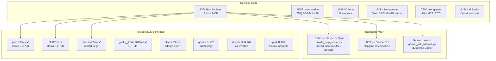
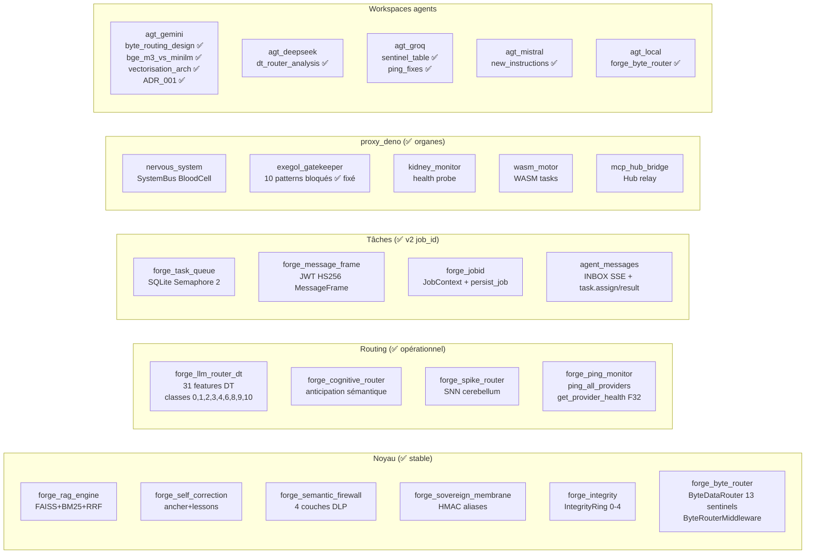
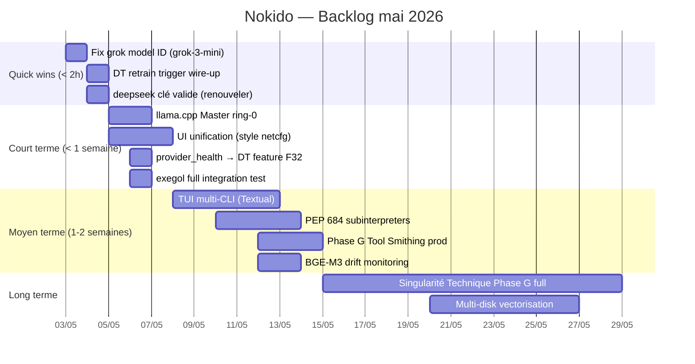
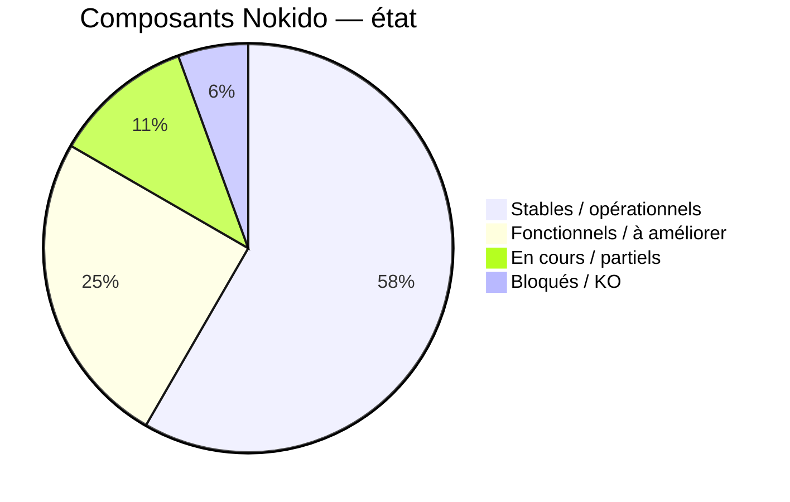

# ATLAS Nokido — 2026-05-03
*Analyse complète: git history + sessions CLI + roadmaps actives*

---

## État système



---

## Timeline phases (git history 2026-04-19 → 2026-05-03)

```mermaid
timeline
    title Nokido — Phases avril-mai 2026
    section Semaine 1 (19-22 avril)
        Phase B Deno : webhub :7401 + hub MCP :8769
        RBAC + entities : IntegrityRing + capability tokens
        Security hardening : SemanticFirewall ultrareview fixes
        TUI v2 : multi-CLI orchestration
    section Semaine 2 (23-26 avril)
        Phase G Tool Smithing : JIT + tree-sitter + dual-model peer review
        Kill Switch Sémantique : roadmap Singularité Technique
        Anatomy live : 19 organes SVG biomimétiques
        Autonomous loops : 7 patterns circadiens + git tree
        Skill policy : forge_skill_policy + trailofbits revert
    section Semaine 3 (27-30 avril)
        pydantic/anyio fix : LAFORGE_PYTHON strict + PYTHONNOUSERSITE
        DT Router v1 : 31 features + 11 providers
        Groq/SambaNova : bench latence + provider_scores DB
        Phase H autonomie : homeostasis_orchestrator + boucle évolutive
        Deno organs : proxy_deno nervous_system + ZMQ bridge
    section Semaine 4 (1-3 mai)
        Phase H suite : brain_worker NPU + serialiser datetime ZMQ
        Convergence alpha : hub+rings+netcfg+wasm+capture
        Orchestrate Qwen : agentic loop llama-server :8091
        Task system v2 : job_id + MessageFrame + JWT signing + RAG index
        Parallel tools fix : ThreadPoolExecutor stdio + uvicorn 120s
        Providers live : groq/hf/mistral/github confirmés
        ByteDataRouter : 13 sentinels + provider_health F32
```



---

## Cartographie composants — état réel



---

## Roadmap — priorités restantes



---

## Gaps identifiés — conversations analysées

### Jamais commencés (mention mais pas implémenté)

| Gap | Mentionné | Priorité | Action |
|---|---|---|---|
| `grok` model ID fix | session 2026-05-03 | HIGH | `grok-3-mini` ou `grok-3` |
| `deepseek` API key renouvellement | session 2026-05-03 | HIGH | Vérifier dashboard deepseek.com |
| OpenRouter crédit rechargement | session 2026-05-03 | MEDIUM | kimi/glm5/openrouter providers |
| DT retrain trigger impl | dt_router_analysis | MEDIUM | hook dans forge_idle_watchdog |
| `semantic_ring` (F34) | dt_router_analysis | LOW | IntegrityRing → DT feature |
| `token_cost_budget` (F33) | dt_router_analysis | LOW | budget session → DT feature |
| `provider_health` → DT (F32) | dt_router_analysis | MEDIUM | brancher get_provider_health() |
| exegol test E2E | session | LOW | pip done, gatekeeper fixé |

### Démarré mais pas terminé

| Item | État | Reste |
|---|---|---|
| Phase G Tool Smithing JIT | MVP commit `0af0cce` | Tests sandbox + tree-sitter prod |
| TUI multi-CLI | `f1f6b0b` feat | Textual layouts + adapters CLI |
| UI unification | roadmap_ui_unification.md | Patcher 6 UIs vers style netcfg |
| llama.cpp Master ring-0 | roadmap_master_llamacpp.md | Ring promotion + IntegrityRing |
| PEP 684 subinterpreters | roadmap_pep684_subinterpreters.md | Non commencé |
| Gemini GEMINI.md tools centralisé | ✅ fait 2026-05-03 | — |

---

## Historiques de conversation — disponibilité

| Source | Accessible | Localisation | Notes |
|---|---|---|---|
| **Claude CLI** | ✅ OUI | `~/.claude/projects/C--Users-user-Script-python-IA-LaForge/*.jsonl` | JSONL complets, ~7 sessions récentes |
| **Gemini CLI** | ⚠️ PARTIEL | `~/.gemini/tmp/nokido/chats/session-*.json` | Dernière session: 2026-04-22. Sessions Mai non sauvegardées (bug?) |
| **Claude Desktop** | ❌ NON | `AppData/Roaming/Claude/` = config seulement | Historique conversations = cloud Anthropic, non local |
| **Gemini Web** | ❌ NON | Aucun fichier local | Cloud Google uniquement |

### Sessions Claude CLI récentes (analysables)
```
~/.claude/projects/C--Users-user-Script-python-IA-LaForge/
  5f69a51a-4b5b-41cf-b567-eb9264f51815.jsonl  ← session courante (compactée)
  62cff196-65ed-4009-974e-28830b61e321.jsonl
  d084c70f-eed6-47de-837d-51bc77258cd6.jsonl
  e3818f29-0e15-43de-b3f1-1c773a09e2c8.jsonl
  f2d903d9-7c4c-464b-b2bb-3a1e3362bdcb.jsonl
  543b36d7-d45a-446e-b8a9-d9133fcd7215.jsonl
```

Pour analyser une session: `LAFORGE_PYTHON -c "import json; [print(m['role'],':',str(m.get('content',''))[:100]) for m in [json.loads(l) for l in open('PATH').readlines() if l.strip()]]"`

### Récupération sessions Gemini CLI Mai
Sessions non dans `tmp/nokido/chats/` → probablement dans `~/.gemini/history/nokido/` (dossier vide sauf `.project_root`). Gemini CLI ne sauvegarde peut-être que sous certaines conditions. Vérifier `gemini --save-history` flag.

---

## Score santé système (2026-05-03)



| Catégorie | Composants |
|---|---|
| ✅ Stables | Hub :8766, RAG engine, SemanticFirewall, SovereignMembrane, IntegrityRing, brain_worker, ByteDataRouter, TaskSystem v2, forge_ping_monitor, ollama, groq, hf, mistral, github |
| ⚠️ À améliorer | gemini (quota), DT router (retrain), UI (6 interfaces divergentes), TUI (partiel) |
| 🔄 En cours | Phase G Tool Smithing, llama.cpp Master ring-0, PEP 684, exegol E2E |
| ❌ Bloqués | deepseek (clé), grok (modèle), kimi/glm5 (crédit OpenRouter), Gemini CLI history |
