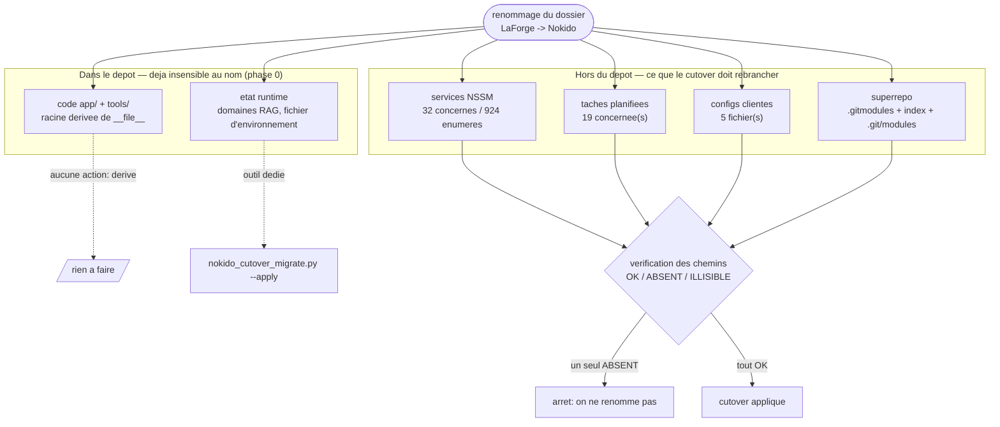
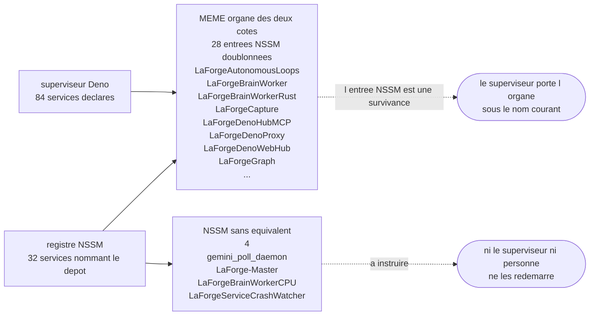

# Runbook de cutover — renommage du dossier `LaForge` vers `Nokido`

> Genere par `tools/nokido_cutover_runbook.py` le 2026-08-11 11:20. **Ne pas editer a la main** :
> regenerer. Les nombres ci-dessous sont des MESURES, pas des estimations.

## Ce que le cutover doit rebrancher



Le code du depot n'est **pas** concerne : la phase 0 lui a fait deriver sa racine de
`__file__`. Ce qui casse au renommage, c'est ce qui vit **dehors** et le nomme en dur.

| surface | mesure | denominateur |
|---|---:|---|
| services NSSM | 32 | 924 services enumeres, 387 non-NSSM, **3 illisibles** |
| taches planifiees | 19 | 875 ligne(s) enumerees |
| configs clientes | 5 | profil scanne `%USERPROFILE%` · 1 absente(s), **0 illisible(s)** |
| chemins verifies | 104 | 0 illisible(s), **0 deja mort(s)** |

`ILLISIBLE` n'est pas `ABSENT` : un compte qui n'a pas le droit de statuer ne prouve
rien. Toute ligne illisible ci-dessus doit etre relue depuis la **console owner** avant
de conclure.

## Qui gouverne quoi (et ce que personne ne gouverne)



Comparaison faite **prefixe de marque retire** : le superviseur declare les organes sous
le nom courant, le registre les porte sous l'ancien. Sans cette normalisation
l'intersection tombe a 1 et le diagramme accuse a tort une trentaine d'orphelins.

Un service NSSM que le superviseur ne declare pas ne sera **redemarre par personne**.
Avant de le reecrire, trancher : reliquat a supprimer, ou secours manuel a garder ?

## Ce qui est deja casse AVANT le cutover

_Aucune reference morte : le cutover peut etre applique._

Ces references ne sont **pas** un effet du renommage : elles sont mortes maintenant. Le
script refuse `--apply` tant qu'elles sont la — sinon le cutover porterait leur chapeau.

Deux precautions avant de conclure sur une reference absente : un binaire peut avoir ete
produit **ailleurs** (repertoire de sortie redirige, installation dans le profil), et le
profil de l'owner est **illisible** depuis un compte de service — ou `exists()` rend
`False` pour un dossier qui existe. Trancher en **console owner**, pas ici.

## Rayon de souffle du code (graphe d'imports, 2419 aretes internes)

| module | importe par | 2e rang | importateurs directs |
|---|---:|---:|---|
| `forge_secrets` | 99 | 198 | `after_model_hook`, `assign_gemini_tasks`, `auth`, `delegate_tasks`, `forge_agent_proxy` |
| `forge_self_correction` | 72 | 131 | `Nokido`, `agent`, `app`, `auto_boot_20260319_153549`, `auto_boot_20260319_160236` |
| `forge_db_path` | 34 | 142 | `audit_rfc_compliance`, `forge_active_inference`, `forge_body_regulation_audit`, `forge_capteur_dense_apport_bench`, `forge_chain_executor` |
| `forge_endocrine` | 32 | 143 | `forge_agency`, `forge_agent_proxy`, `forge_amygdala`, `forge_coagulation`, `forge_coagulation_cascade` |
| `forge_machine_vault` | 29 | 119 | `browser_mcp`, `browser_supervisor`, `ch88_llm_panel_runner`, `ch88_wake_watch_runner`, `forge_acp_adapter` |
| `forge_app_context` | 47 | 97 | `Nokido`, `_participants`, `auto_boot_20260319_153549`, `auto_boot_20260319_160236`, `auto_boot_20260320_030321` |
| `forge_context` | 28 | 94 | `Nokido`, `_participants`, `auto_boot_20260319_153549`, `auto_boot_20260319_160236`, `auto_boot_20260320_030321` |
| `forge_embed_router` | 24 | 71 | `forge_bge_m3_shared`, `forge_chain_executor`, `forge_code_reindex`, `forge_embed_auto_trigger`, `forge_embed_backfill` |
| `forge_llm_router` | 28 | 66 | `commands_via_facade`, `di_container`, `forge_agent_proxy`, `forge_bfcl_runner`, `forge_capability_registry` |
| `forge_agent_proxy` | 36 | 58 | `forge_acp_server`, `forge_arbitrator`, `forge_biblio_core`, `forge_card_summarize`, `forge_circadian_loop` |

## Marche a suivre

```bash
# 1. Mesurer, sans rien ecrire (n'exige pas l'elevation)
LAFORGE_PYTHON tools/nokido_cutover_owner.py

# 2. Voir chaque reecriture et sa cible verifiee
LAFORGE_PYTHON tools/nokido_cutover_owner.py --plan

# 3. Purger les references deja mortes (sinon --apply refuse)

# 4. Appliquer, en console ELEVEE
LAFORGE_PYTHON tools/nokido_cutover_owner.py --apply --confirm RENOMMER

# 5. Revalider apres coup
LAFORGE_PYTHON tools/nokido_cutover_owner.py --verify

# 6. En cas de doute, revenir en arriere
LAFORGE_PYTHON tools/nokido_cutover_owner.py --rollback sandbox/cutover_<horodatage>
```

`--apply` fait, dans cet ordre : arret des services, renommage du dossier, reecriture des
references (registre, taches, configs), alignement du superrepo, migration de l'etat
runtime par `nokido_cutover_migrate.py`, verification, redemarrage. Un instantane complet
est ecrit **avant** la premiere ecriture ; c'est lui que rejoue `--rollback`.

## Ce que le script ne fait PAS, volontairement

- Il ne touche pas aux **noms de services, de comptes, de variables d'environnement ni au
  fichier d'environnement** : le nom du dossier en est aussi le prefixe, et la reecriture
  est contrainte au **segment de chemin** pour cette raison exacte.
- Il n'imprime **jamais** la valeur d'une variable d'environnement de service : plusieurs
  portent des jetons en clair. Seuls les noms apparaissent.
- Il ne reimporte pas automatiquement les taches planifiees au rollback : l'XML d'origine
  est dans l'instantane, la reimportation se fait a la main et se verifie.
