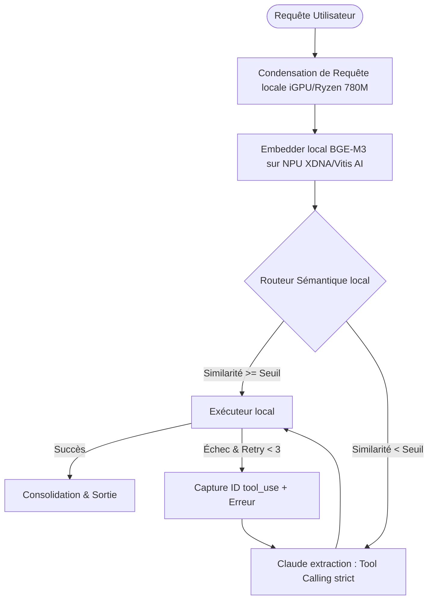

# Plan de Déploiement : Architecture Hybride Résiliente & Souveraine (Nokido / LaForge)

> 🧭 **PROTOTYPE NON PROMU (réconciliation 2026-08-21).** Le cœur (machine à états, Query Condenser, routage cosinus THRESHOLD=0.45) existe dans `sandbox/hybrid_state_machine.py` — prototype **jamais promu en `app/`**. Reste à faire : promotion + tests, sinon c'est un backlog déguisé en fait.

Ce plan décrit les étapes concrètes pour intégrer le **Routeur Sémantique local (NPU)**, le **Condensateur de requêtes multi-tours (iGPU)**, et la **Boucle de résilience transactionnelle (LangGraph / Anthropic Tool Correction)** au sein du hub local.

---

## 📋 Synthèse du Flux d'Exécution

---

## 🛠️ Phases d'Intégration et Déploiement

### Phase 1 : Exportation & Validation Matérielle (NPU Ryzen AI)
L'objectif est de décharger entièrement les calculs sémantiques (BGE-M3) sur le NPU XDNA pour libérer l'iGPU Radeon 780M.

1. **Compilation ONNX INT8 de BGE-M3 :**
   * Utiliser l'outil **Ryzen AI Olive CLI** pour exporter et quantifier `BAAI/bge-m3` au format ONNX FP16/INT8.
   * Déposer le modèle dans `LaForge/app/models/npu/bge_m3_int8.onnx`.
2. **Configuration du Runtime Isolé :**
   * S'assurer que l'environnement isolé `ryzen-ai-final` (utilisant `numpy 1.26.4`) configuré sur Windows est fonctionnel pour éviter les conflits NumPy 2.x via `forge_npu_embedder.py`.
   * Lancer un probe test pour valider la DLL Vitis AI (`dyn_dispatch_core.dll`) et le fichier de configuration `vaip_config.json`.

---

### Phase 2 : Raccordement du Routeur Sémantique Local
Utilisation de la similarité cosinus locale pour trier les requêtes sans solliciter l'API d'Anthropic.

1. **Mise à niveau du routeur sémantique :**
   * Ajuster le module `forge_semantic_routes.py` pour exploiter le nouveau modèle 1024D (BGE-M3) à la place du MiniLM 384D.
   * Lancer le selftest : `python app/forge_semantic_routes.py --selftest` pour tester la réponse du routeur.
2. **Auto-apprentissage semi-supervisé :**
   * Activer l'enrichissement des centroïdes via les requêtes issues des sessions résolues avec succès (`dialogue_win` de `embeddings.db`).

---

### Phase 3 : Déploiement du Query Condenser (iGPU)
Correction du point aveugle conversationnel (requêtes courtes de type multi-tours).

1. **Configuration du LLM local de réécriture :**
   * Déployer un modèle léger (ex : `Qwen-2.5-3B-Instruct` ou `Gemma-2-2B-it`) sur le runtime local `NokidoLlamaNative` (port `:8091`).
   * **Attention (Alerte microglie RAM) :** Configurer le modèle sans l'option `--mlock` pour ne pas bloquer inutilement 7 GB de RAM physique et éviter les churns de processus dénoncés sur le tableau de bord (`active_bugs`).
2. **Intégration du nœud de condensation :**
   * Insérer la fonction de réécriture de prompt dans le pipeline d'entrée du graphe de décision.

---

### Phase 4 : Implémentation du Graphe de Décision et Self-Correction (LangGraph)
Mise en place d'une boucle d'auto-correction robuste face aux hallucinations du LLM tiers.

1. **Définition de l'AgentState :**
   * Implémenter l'état Pydantic validé en utilisant `Annotated[list[dict[str, Any]], operator.add]` pour la gestion de l'historique de conversation (`history`).
2. **Câblage de la boucle de rétroaction Anthropic :**
   * Configurer le nœud d'extraction de Claude pour conserver l'ID du dernier appel d'outil défectueux (`last_tool_use_id`).
   * Si une exception d'exécution est capturée dans le nœud local, construire le payload d'API contenant la séquence obligatoire d'Anthropic :
     * Message `user` : Requête condensée.
     * Message `assistant` : Bloc `tool_use` d'origine.
     * Message `user` : Bloc `tool_result` avec `is_error=True` et le message d'erreur d'exécution.
3. **Purger l'état :**
   * Injecter systématiquement des dictionnaires de paramètres vides au début de chaque nouvelle session utilisateur pour éviter les corruptions de transactions.

---

### Phase 5 : Campagne de Tests et Alignement
1. **Tests unitaires :**
   * Écrire et exécuter la suite de tests unitaires (ex: `pytest tests/test_hybrid_graph.py`) pour valider la tolérance aux pannes (réinjection de faux paramètres et observation de la correction).
2. **Règle de confinement (Alerte de sécurité) :**
   * *Rappel du Blackboard :* Ne pas exécuter de script de renommage global sur le dépôt (comme `nokido_migrator.py --apply`). Effectuer les modifications chirurgicalement dans les répertoires autorisés `sandbox/` et `app/`.
