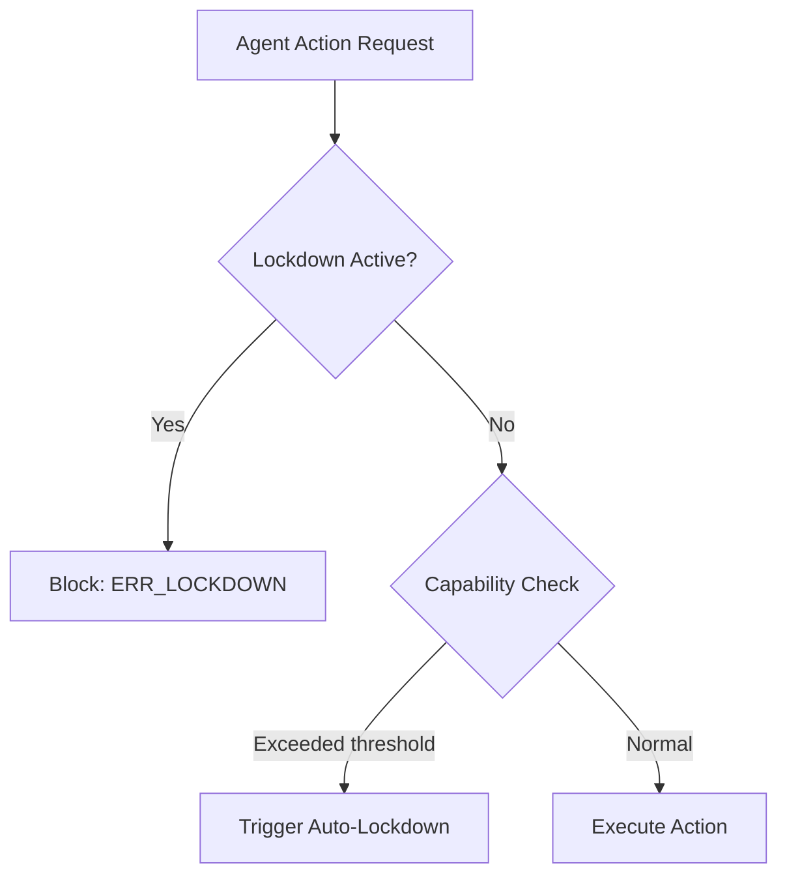

# Independent Safety Audit & Integration Design

**Author**: `ANTIGRAVITY`  
**Date**: 2026-07-26  
**Status**: Completed Audit & Proposed Core Design (Zero code edits on core files)  
**Pointer Reference**: `blackboard:architecture_rules/roadmap_audit_veille_gap_safety_cluster`  

---

## 1. Verdict on the 3 Delivered Safety Organs

We have performed a full code audit of the three modules delivered by CLAUDE:
1. **`forge_red_team_probe.py` (Deception/Alignment)**: **VERDICT: FUNCTIONAL but ISOLATED**.  
   *Analysis*: Properly implements character/token regex and LLM evaluation on 6 risk categories. It is not currently cabled in the homeostasis cycle. It only runs when manually triggered via CLI.
2. **`forge_metric_integrity.py` (Anti-Goodhart)**: **VERDICT: FUNCTIONAL but INERT**.  
   *Analysis*: Scans for provider trust-usage divergence, novelty saturation, and bibliography relevance mismatch. It is referenced in `forge_full_audit.py` and `forge_organ_smoke_audit.py` but does not feed back to the homeostat to downgrade permissions.
3. **`forge_rag_introspect.py` (RAG Interpretability)**: **VERDICT: FUNCTIONAL**.  
   *Analysis*: Correctly decomposes surfaced RAG chunks into BM25 lexical vs density/trust components, flagging opaque retrievals. However, it is not used dynamically during search to filter out low-overlap/high-trust noise.

**Verdict Summary**: The organs are well-written codebase assets, not empty shells. However, they lack **integration** with the active nervous system (Homeostat / Hub).

---

## 2. Design of Weak-to-Strong / Scalable Oversight

While `forge_scalable_oversight.py` defines the strong judge panel (`STRONG_PRIORITY`), it is not cabled to intercept live operations.

### Proposed Integration Pattern:
1. **Gated Dispatch Hook**:
   When a Ring 1 or 2 agent requests a high-impact operation (e.g. `write_file` or `run_command` on core files), if the agent's recent `trust_score` is below 0.8, the Hub intercepts the request.
2. **Verification Call**:
   The Hub invokes `forge_scalable_oversight.oversee(task, proposed_diff, panel=3)`.
3. **Escalation Policy**:
   - If the panel consensus is `approve` $\rightarrow$ proceed.
   - If consensus is `flag` $\rightarrow$ downgrade agent to `READ_ONLY` and log warning.
   - If consensus is `reject` $\rightarrow$ block the action and raise `SECURITY_ALARM`.

---

## 3. Design of Corrigibility & RSP-ASL on `forge_agent_authority.py`

To prevent agent runaway, we propose adding **Capability Thresholds** and an **Emergency Lockdown (Kill Switch)** to `forge_agent_authority.py`:



### Proposed Schema & Logic Additions:

#### A. Authority State Schema Updates (`config/authority_state.json`)
```json
{
  "master_dev": { ... },
  "security_posture": {
    "emergency_lockdown": false,
    "lockdown_reason": null,
    "last_lockdown_ts": null,
    "lockdown_token_hash": "..."
  },
  "capability_windows": {
    "agent_id": {
      "hourly_file_edits": 0,
      "hourly_token_spend": 0,
      "last_reset": 1785084931
    }
  }
}
```

#### B. API Interface extensions:
1. `trigger_lockdown(token_clear: str, reason: str) -> bool`:
   Validates the token hash and flips `emergency_lockdown` to `true`.
2. `release_lockdown(token_clear: str) -> bool`:
   Restores normal operation.
3. `check_authority(agent_id: str, action: str) -> tuple[bool, str]`:
   Before returning `ok`, checks if `emergency_lockdown` is active. If active, returns `(False, "ERR_LOCKDOWN")`.

#### C. Auto-Lockdown (Corrigibility Trigger):
If the hourly file edits exceed $E_{\max}$ (e.g., 50 file modifications in 1 hour) or `forge_red_team_probe.py` returns a `high` severity alignment failure, `forge_agent_authority` automatically activates lockdown, revoking all `MASTER_DEV` tokens.
